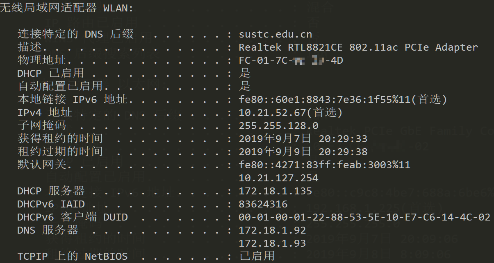
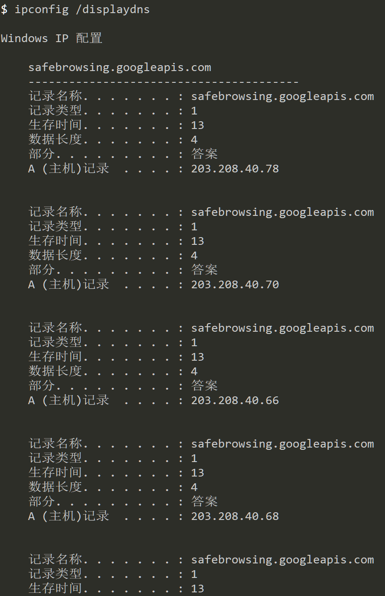
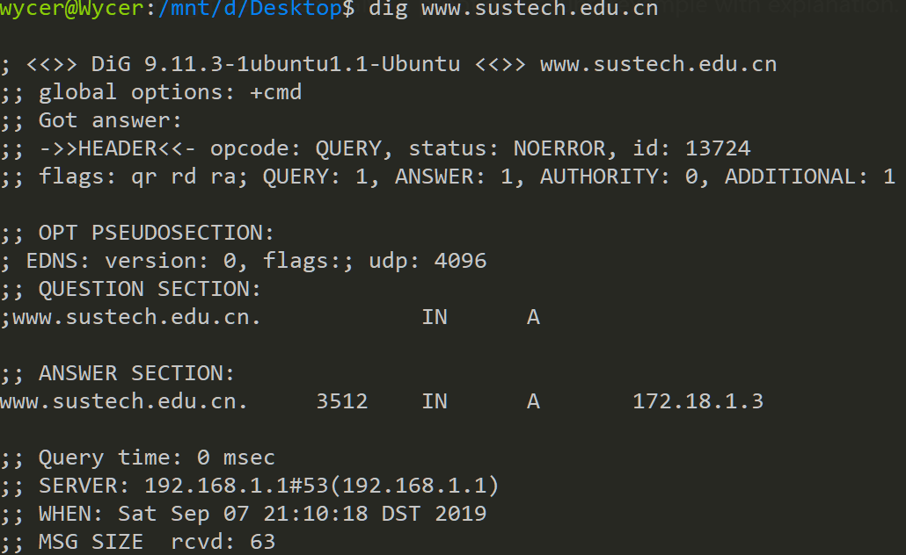
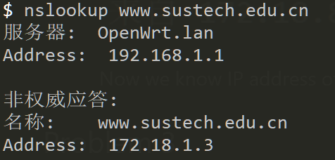
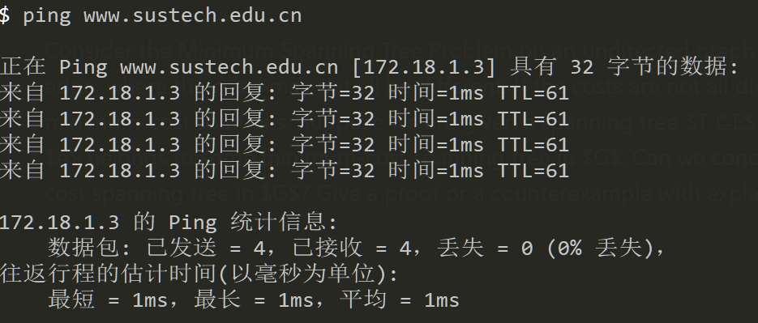
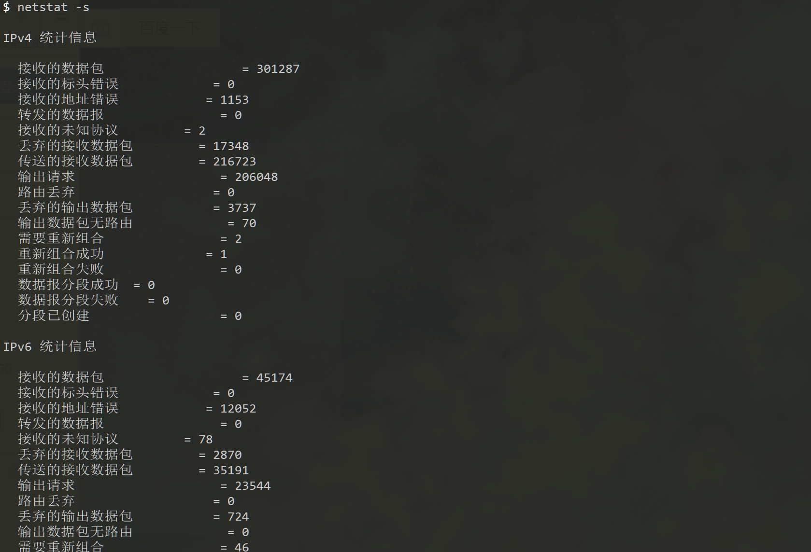
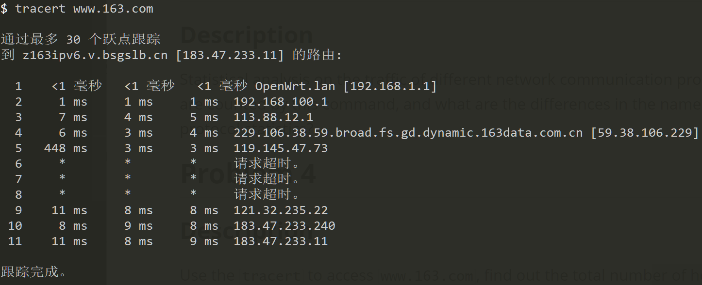

# Assignment1 for CS305

## Some info...

Author: 11711918 吴烨昌

Network environment of test machine:  two network interfaces:

1. Wired connection to a router. Its IP address is 192.168.1.225.
2. Wireless connection to campus network. Its IP address is 10.21.52.67.

## Problem 1

### Description

> Query the ip address and MAC address of host, the ip address of gateway and DHCP server, the subnet mask.
> Please determine whether the IP address of host is allocated statically or dynamically through DHCP. If the address is allocated dynamically, how long is the lease time of the current IP ?

### Solution

use `ipconfig /all` command to list all network interfaces.

- IP address(of host): `10.21.52.67`
- MAC address(of host): `FC-01-7C-**-**-4D` (Masked for privacy concerns)
- IP address of gateway: `10.21.127.254`(ipv4), `fe80::4271:83ff:feab:3003%11`(ipv6)
- DHCP server: `172.18.1.135`
- Subnet mask: `255.255.128.0`
- DHCP Enabled: `true` (IP address of host is allocated dynamically through DHCP)
- The lease time of the current IP: `2days and 5 seconds`

## Problem 2

### Description

> DNS provides the corresponding relationship between domain name and IP address.
> Please query 1) IP address of host’s DNS server 2) DNS information stored in host 3) IP address of www.sustech.edu.cn

## Solution

1. IP address of host’s DNS server is `172.18.1.92`, `172.18.1.93` (refer to screenshot in problem1)

2. use `ipconfig /displaydns` command to query all dns information stored in host. (There is too many records)

3. IP address of site `www.sustech.edu.cn` (in campus network) is `172.18.1.13`
		1. Use `dig www.sustech.edu.cn` command in WSL or linux to query IP address of site `www.sustech.edu.cn`.
		​		    
2. Use `nslookup www.sustech.edu.cn` command in WSL or linux to query IP address of site `www.sustech.edu.cn`.
			​		
       
 3. Or just easily `ping www.sustech.edu.cn`
            ​	

## Problem 3

### Description

Statistical analysis on the traffic of different network communication protocols, please list which protocols are counted by this command, and what are the differences in the names of statistical objects in different protocol statistics?

use `netstat -s` command to do statistical analysis.

following protocols are counted:
1. IP
2. IPv6
3. ICMP
4. ICMPv6
5. TCP
6. TCPv6
7. UDP
8. UDPv6

Differences:
- In IP or IPv6, unit of messages is "Packet"(数据包)
- In ICMP or ICMPv6, unit of messages is "Message".
- In TCP or TCPv6, unit of messages is "Packet"(数据包)
- In UDP or UDPv6, unit of messages is "Datagram"(数据报)
## Problem 4

### Description

Use the `tracert` to access `www.163.com`, find out the total number of hops from the local host to the target. Are there any ICMP messages lost during the tracert process? What is the IP address of the server on which `www.163.com` is located?

1. **11** hops from local host to the target(www.163.com)
2. Yes. Messages lost at hop 6, hop 7, hop 8.
3. `183.47.233.11`

## Summary

1. Use `ipconfig` to list network attributes, use `netstat` to query network status and statistics.
2. (Maybe only?) `Ping` and `tracert` use ICMP. Use ping or `tracert` to test network connection. Use `tracert` to know how packet forwarded from host to target.
3. Use `dig` or  `nslookup` to query IP of a domain.

In problem 4, ICMP packet sended by  `tracert` does not go through my wireless network interface. (Because the first hop is `192.168.1.1`, which is gateway of my wired network interface.)