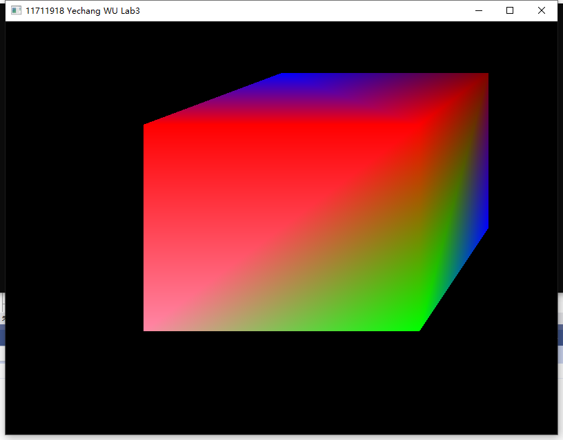

# Template

吴烨昌 & 11711918

## Experimental aims

- know how to use VAO and VBO

- write vertex shader and fragment shader

- know how to draw basic 2-D and 3-D shapes 

## Experimental setting
glad
windows 10
GPU
openGL 3.3

## Experimental content（key functions with code and clear comments）

1. create the window object

2. set the dimentions of window and start the depth test

3. create an array to store the vertex information

4. create and bind VAO and VBO

5. call `glBufferData` to transfer the data of the array to the buffers

6. call `glVertexAttribPointer` to set the pointers of vertex attributes

7. set the model matrix, observation matrix and projecting matrix

8. Call `glDrawArrays` to draw 12 triangles

    ```
    #include <GLFW/glfw3.h>
    
    float vertices[] = {
        //位置属性          //颜色属性
         0.5f, -0.5f, 0.0f, 0.0f, 1.0f, 0.0f, // 1
        -0.5f, -0.5f, 0.0f, 1.0f, 0.53f, 0.65f, // 0
         0.5f,  0.5f, 0.0f, 1.0f, 0.0f, 0.0f, // 4
        -0.5f,  0.5f, 0.0f, 1.0f, 0.0f, 0.0f, // 5
         0.0f, 0.75f, 0.0f, 0.0f, 0.0f, 1.0f, // 6
        0.75f,  0.0f, 0.0f, 0.0f, 0.0f, 1.0f, // 2
         0.5f, -0.5f, 0.0f, 0.0f, 1.0f, 0.0f, // 1
        0.75f, 0.75f, 0.0f, 0.5f, 0.0f, 0.0f, // 3
         0.5f,  0.5f, 0.0f, 1.0f, 0.0f, 0.0f, // 4
         0.0f, 0.75f, 0.0f, 0.0f, 0.0f, 1.0f  // 6
    };
    
    GLuint createTrangle()
    {
        GLuint VAO, VBO;
        glGenVertexArrays(1, &VAO);
        glGenBuffers(1, &VBO);
    
        glBindVertexArray(VAO);
        glBindBuffer(GL_ARRAY_BUFFER, VBO);
        glBufferData(GL_ARRAY_BUFFER, sizeof(vertices), vertices, GL_STATIC_DRAW);
    
        glVertexAttribPointer(0, 3, GL_FLOAT, GL_FALSE, 6 * sizeof(float), (void*)0);
        // 颜色属性
        glVertexAttribPointer(1, 3, GL_FLOAT, GL_FALSE, 6 * sizeof(float), (void*)(3 * sizeof(float)));
        glEnableVertexAttribArray(0);
        glEnableVertexAttribArray(1);
        return VAO;
    }
    
    GLuint createProgramme()
    {
        const char* vertex_shader =
            "#version 400\n"
            "layout (location = 0) in vec3 aPos;"     // 位置变量的属性位置值为 0
            "layout (location = 1) in vec3 aColor;"   // 颜色变量的属性位置值为 1
            "out vec3 myColor;"                       // 向片段着色器输出一个颜色
            "void main(){"
            "gl_Position = vec4(aPos, 1.0f);"
            "myColor = aColor;"
            "}";
        const char* fragment_shader =
            "#version 400\n"
            "in vec3 myColor;"
            "out vec4 frag_color;"
            "void main(){"
            "frag_color = vec4(myColor, 1.0f);"
            "}";
    #ifdef _DEBUG
        int success;
        char infoLog[512];
    #endif
    
        GLuint vertexShader = glCreateShader(GL_VERTEX_SHADER);
        glShaderSource(vertexShader, 1, &vertex_shader, NULL);
        glCompileShader(vertexShader);
    
    #ifdef _DEBUG
        glGetShaderiv(vertexShader, GL_COMPILE_STATUS, &success);
        if (!success) {
            glGetShaderInfoLog(vertexShader, 512, NULL, infoLog);
            printf("Failed to compile vertexShader:%s\n", infoLog);
        }
    #endif
    
        GLuint fragmentShader = glCreateShader(GL_FRAGMENT_SHADER);
        glShaderSource(fragmentShader, 1, &fragment_shader, NULL);
        glCompileShader(fragmentShader);
    
    #ifdef _DEBUG
        glGetShaderiv(fragmentShader, GL_COMPILE_STATUS, &success);
        if (!success) {
            glGetShaderInfoLog(fragmentShader, 512, NULL, infoLog);
            printf("Failed to compile fragmentShader:%s\n", infoLog);
        }
    #endif
    
        GLuint shaderProgram = glCreateProgram();
        glAttachShader(shaderProgram, fragmentShader);
        glAttachShader(shaderProgram, vertexShader);
        glLinkProgram(shaderProgram);
    
    #ifdef _DEBUG
        glGetProgramiv(shaderProgram, GL_LINK_STATUS, &success);
        if (!success) {
            glGetProgramInfoLog(shaderProgram, 512, NULL, infoLog);
            printf("Failed to linkProgram:%s\n", infoLog);
        }
    #endif
    
        glDeleteShader(vertexShader);
        glDeleteShader(fragmentShader);
        return shaderProgram;
    }
    
    int main(void)
    {
        GLFWwindow* window;
    
        /* Initialize the library */
        if (!glfwInit())
            return -1;
        /* Create a windowed mode window and its OpenGL context */
        window = glfwCreateWindow(640, 480, "Hello World", NULL, NULL);
        if (!window)
        {
            glfwTerminate();
            return -1;
        }
    
        /* Make the window's context current */
        glfwMakeContextCurrent(window);
    
        /* Loop until the user closes the window */
        while (!glfwWindowShouldClose(window))
        {
            /* Render here */
            glClear(GL_COLOR_BUFFER_BIT);
            
            /*draw a triangle*/
            glUseProgram(programme);
            glBindVertexArray(VAO);
            glDrawArrays(GL_TRIANGLES, 0, 3);
            glDrawArrays(GL_TRIANGLES, 1, 3);
            glDrawArrays(GL_TRIANGLES, 2, 3);
            glDrawArrays(GL_TRIANGLES, 5, 3);
            glDrawArrays(GL_TRIANGLES, 6, 3);
            glDrawArrays(GL_TRIANGLES, 7, 3);
            glBindVertexArray(0);
    
            /* Swap front and back buffers */
            glfwSwapBuffers(window);
    
            /* Poll for and process events */
            glfwPollEvents();
        }
        glfwTerminate();
        return 0;
    }
    ```


## Experimental results

screenshot of testing examples

